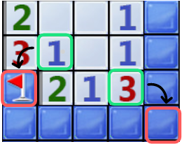
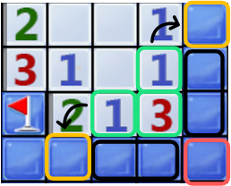
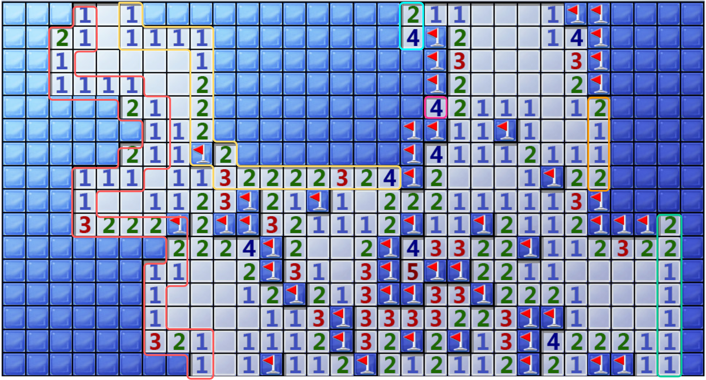
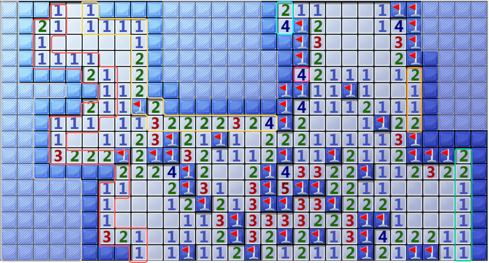

# Auto-minesweeper

---

终端可视化扫雷:

```bash
python main.py
```

利用复刻的终端扫雷模拟胜率：

```bash
python chance_of_winning.py
```

与winmine.exe交互完成扫雷：

 - 首先打开winmine.exe

```bash
python xp_auto_play.py
```

Note that: 需要python 3.8及以上环境，因为需要用到内置math.comb函数，只有3.8以上版本才有。

## 文件结构

---

minesweeper: 自己写的，在终端运行的扫雷

solver: 自动扫雷推理代码

resolver: 用cv解析win7扫雷界面的代码（但是效果不好，且由于win7扫雷大量的光影效果，要装很多库，而且提取鲁棒特征会很慢）

bot: 模拟鼠标点击自动完成win7扫雷的代码

winmine.exe: xp版扫雷

main.py: 终端可视化扫雷

chance_of_winning.py: 利用自己写的终端扫雷模拟胜率

xp_auto_play.py: 与winmine.exe交互完成扫雷

global_variables.py: 一些全局设置

## 如何完成推理

---

### 一些定义：

---

（可能和其他扫雷文档的定义不同）

Unseen 未知方块 $\mathcal{U}$ ：未点开也未插旗的方块

Inland unseen 内部未知方块：未与任何数字提示接壤的未知方块

Hint 数字提示方块：i.e., 0,1,2,3,4,5,6,7,8 （不过从来没遇到过8）

Incomplete hint 不完整数字提示方块  $h$：周围存在未知方块的数字提示

Flag：插旗或者旗帜方块

$\mathcal{F}$：所有已确定的旗帜方块集合

$R$：剩余雷数

$M$：总雷树（高级下为99）

### 推理分为三个等级

---

- Level 1：单个方块推理
    
    该等级的推理只能处理某个未知方块的接壤未知方块。
    
    具体地，对于某一个不完整数字提示方块 $h$，找到所有与其接壤的未知方块 $\mathcal{U}_h$ 。计算在 $\mathcal{U}_h$ 中的地雷数量 $\mathcal{M}_h$（即数字提示 - 与其接壤的插旗方块数），迭代所有在 $\mathcal{U}_h$ 中埋下 $\mathcal{M}_h$个地雷的情况假设。在迭代的过程中，需要根据周围的数字提示方块判断某种情况假设是否合理，并记录下 $\mathcal{U}_h$中每个方块出现地雷的次数和总合理假设的数量，并最终得到 $\mathcal{U}_h$中每个未知方块是雷的概率。
    
    - 情况假设合理需要满足以下所有的条件：
        
        $\mathcal{P}^h$：（Pseudo Hint）假设中的数字提示方块集合，$\mathcal{P}^f$：（Pseudo Flag）假设中的旗帜方块集合
        
        1. $| \mathcal{P}^f |$ + $| \mathcal{F} |$ ≤ $M$
        2.  $| \mathcal{U} |$（不包括假设，仅包括已确定的） - $| \mathcal{P}^h |$ <  $R$，即防止出现就算剩下未知方块都插旗都塞不下剩余雷数的情况
        3. 遍历所有假设中旗帜方块和假设中数字提示方块周围的所有数字提示方块，保证每个数字提示方块都是成立的
    
    不过因为这种概率并没有用到所有已知信息，比如该数字提示方块 $h$周围的数字提示方块，导致得到的概率大部分是不准确的，只有当概率为0 或者 1时即能确保是雷或者不是雷是准确的。所以该等级的推理只能得到确保安全或者确保是雷的情况，并点开或插旗。
    
    比如对于如下情形，利用绿框下的1可推理出左下红框为雷，利用绿框下的3可推理出右下角的红框为雷（因为周围两个1使得右下必须为雷，不然周围5个未知格塞不下3个雷）。
    
    
    

---

- Level 2：联合单个方块和其周围的数字方块推理
    
    相比Level 1，该等级的推理能点开或插旗的范围更广。
    
    具体地，对于某一个不完整数字提示方块 $h$，找到所有与其接壤的未知方块 $\mathcal{U}_h$ 。之后在找到 $\mathcal{U}_h$ 周围所有的不完整数字提示方块 $\mathcal{H}$ （不包括 $h$ ），然后dfs $\mathcal{H} \cup \{ h \}$ 周围所有未知方块的地雷布局可能，最后计算每个涉及到的未知方块埋有雷的概率。同样，因为这种推理没有用到所有已知信息，只有当概率为0（点开）或者1（插旗）时才是准确的。
    
    依旧使用上述例子，在Level 2下除了可以插旗绿框3右下角的红框以外，联合3周围的两个1还能推理得到两个黄框不可能为雷可以点开（因为两个黑框未知格块中已经占用掉两个1的雷数，故两个黄框一定是安全的）。
    
    
    

---

- Level 3：联合全局信息推理
    
    可以推理全局的未知方块埋有雷的准确概率
    
    具体地，首先对所有的不完整的数字提示方块进行分组，每组中两两数字提示方块如果可以相互影响（包括 1. 两者周围共享某个未知方块，2.通过其他不完整数字提示方块的传递，两者周围布雷情况会相互影响），而不同组之间两两数字提示方块不会相互影响，得到分组结果 $\mathcal{G}$ 。如下图即可分组成6组，分别用红色，黄色，青色，梅红色，橙色和绿色框出。
    
    
    
    对于$\mathcal{G}$中的每个组 $\mathcal{G}_i$，都进行dfs枚举得到与该组相邻的所有未知方块中所有布雷的情形（由于dfs本身复杂度非常高，后续会涉及一些优化措施，暂时先按照最朴素的方法解释）。由于两两组之间的并不共享任何接壤的未知方块，所以在每组中抽出一种情形结合即可构成一种合理的边缘布雷情形（称为边缘布雷情形是因为此时只会考虑所有与数字方块相邻的未知方块，而这些都是处在点开和为点开边界的方块）。但是全局中依旧会存在很多没有与任何数字提示方块相邻的内部未知方块，如下图虚线阴影框所示：
    
    
    
    对于这类框，我们在统计得到一个种合理的边缘布雷情形后，需要计算在该情形下，内部未知方块埋雷可能情况。假设此时共有 $\mathcal{I}$ 个内部（Inland）未知方块，且里面布有 $m=R-|\mathcal{F}|-|\mathcal{P}^f|$个雷，则共有 $C_{\mathcal{I}}^m$种情况。所以对于某个合理的边缘布雷情况，共存在 $C_{\mathcal{I}}^m$种合理的全局布雷情况。而当我们把所有的合理边缘布雷情况遍历结束，即可得到全局未知方块布雷的概率。
    
    一些优化：
    
    1. 因为dfs本身复杂度非常高，所以并不是所有组都能完成dfs搜索，并得到所有可能的布雷情况（比如图中红色的一大块就很可能要搜很长很长时间，试图使用dp优化但是太菜d不出来）。所以代码就设置了一个时间（默认为10s），如果在该时限内未能完成搜索，就中止，并拿到一个合理的情况（任一合理的就行）。统计该合理情形中的旗帜数量 F 和涉及的未知方块数量 U 。当与其他组的情形合并时，该组就只有一种合理情形，且在该情形中每个未知方块出现雷的次数为 F / U（即为概率）。
    2. 即便完成dfs，dfs后可能的局部情形数量将会非常非常多，再联立所有的组中所有可能的局部情形，将会非常非常恐怖。但是由于两两组之间的并不共享任何接壤的未知方块，所以对于某个组而言，其他组具体怎么布雷是不影响结果的，唯一有影响的是其他组总共布置多少雷，这会影响内部未知方块存在多少种布雷情形（即 $C_{\mathcal{I}}^m$），所以我们在统计组内布雷情形时，并不需要记录每一种情形的具体布雷方式，只要记录该组如果布下n个雷时，每个未知出现雷的次数即可。之后在用dp计算，所有其他组共布置了N个雷时，每个涉及到的未知方块出现雷的次数，再与该组情形分别联立即可。联立时需要保证联立后的结果是合理的，即满足Level 1 中tog所示的要求。

### 如何使用每个等级的推理

---

首先会遍历所有的不完整的数字提示方块，进行Level 1和Level 2的推理，得到所有安全的操作（包括安全的点开和确信的插旗）。如果并没有任何安全的操作，则进行Level 3的推理，得到精准概率后，如果存在安全操作则直接返回结果。如果无安全操作，则需要猜雷。

### 如何猜雷

---

具体地，先按照埋雷概率进行排序，越低越靠前。如果存在同概率的情况，则周围的未知方块数量越少越靠前，得到排名第一的未知方块点开。

### 关于dfs时间限制的问题

---

照理说时间设置越长胜率能越高，但是一般到10s仍然无法完成搜索，基本就会卡很长很长时间20s，30s都于事无补，所以简单尝试更长dfs时限并没有带来可观的胜率提升。

### 至于怎么开局

---

老版扫雷角开，新版扫雷3,3开。

## 一些结果

（使用自己写的扫雷模拟1w次的结果）

老版扫雷胜率：38.5%

新版扫雷胜率：51.5%

## Ref

‣

[https://www.bilibili.com/video/BV1vz411z7t6/](https://www.bilibili.com/video/BV1vz411z7t6/)

[https://zhuanlan.zhihu.com/p/136791369](https://zhuanlan.zhihu.com/p/136791369)

上述三个链接的内容都相当Nice 🌈

